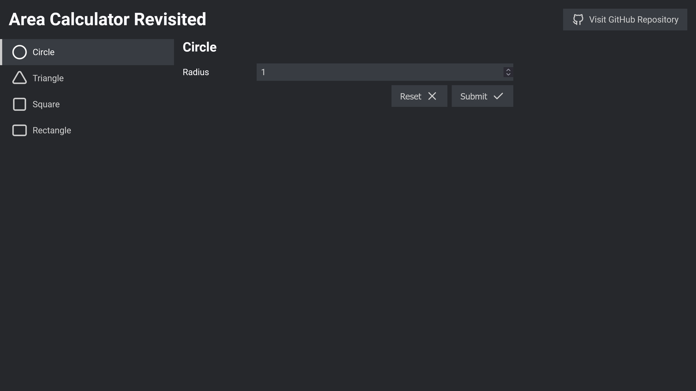

# Area Calculator Revisited




A remake of [Area Calculator](https://github.com/hildergill/area-calculator) built with React, and TypeScript!

## Getting Started

```
$ yarn
$ yarn dev
```

## License

Area Calculator Revisited is licensed under the [MIT License](./LICENSE).
